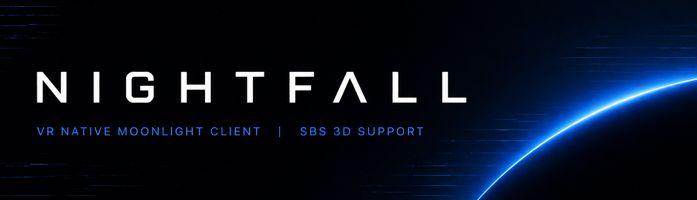

<div align="center">



# Nightfall

**VR-first GameStream client for Meta Quest.**

Stream your PC games into a virtual living room — repositionable screens, stereoscopic 3D,
passthrough, and AI depth estimation, all built native on Godot 4 and OpenXR.

[](https://github.com/tB0nE/nightfall/stargazers)
[](LICENSE)
[](https://github.com/tB0nE/nightfall/releases/latest)

[Features](#features) · [Why Nightfall](#why-nightfall) · [Downloads](#downloads) · [Usage](#usage-and-requirements) · [Building](#building) · [Donate](#donate) · [License](#license)

</div>

---

## Features

- **VR-native streaming** — floating screen in 3D space with grab bars, corner resize, and curvature options
- **HEVC hardware decoding** — NDK MediaCodec pipeline for low-latency H.265 on Quest 3/3S
- **Stereoscopic 3D** — four modes: 2D, SBS Stretch, SBS Crop, and AI 3D
- **AI depth estimation** — MiDaS v2 TFLite converts any 2D stream into stereoscopic 3D via DIBR
- **Touch-style pointer** — laser pointer with trigger-to-click, grip for right-click, thumbstick scroll
- **Passthrough** — see your real room with the stream floating in front of you
- **Curved screen** — flat, slight curve, or full curve with a single button press
- **Bezel toggle** — optional dark border around the screen for a monitor feel
- **Quest Touch Plus models** — real controller models instead of placeholder boxes
- **Starfield environment** — ambient particle starfield for immersion
- **Resolution selector** — Auto/1080p/1440p/4K with host auto-detect
- **Refresh rate selector** — 60/90/120 Hz
- **Stats overlay** — decoder, FPS, bitrate, queue depth, frame drops at a glance
- **SBS auto-detect** — automatically switches stereo mode based on content analysis

## Why Nightfall

Artemis and Moonlight Android are excellent flat-screen clients. Nightfall answers a different question: **what does game streaming look like when VR is the primary interface, not an afterthought?**

| | Nightfall | Artemis | Moonlight Android |
|---|---|---|---|
| **Platform** | Meta Quest 3/3S (native XR) | Android flat | Android flat |
| **Screen** | Floating 3D panel, resizable, curved | Fixed display | Fixed display |
| **Stereo 3D** | AI depth estimation + SBS | SBS only | SBS only |
| **Passthrough** | Full AR passthrough | N/A | N/A |
| **Input** | Laser pointer, trigger/grip/thumbstick | Touch + virtual buttons | Touch + virtual buttons |
| **Environment** | Starfield, 3D positioning | N/A | N/A |
| **HEVC HW** | NDK MediaCodec | MediaCodec | MediaCodec |
| **Custom resolution** | Auto/1080p/1440p/4K | Arbitrary | 720p–4K presets |
| **Custom bitrate** | Auto-scaled by resolution | Yes | Yes |
| **Virtual display** | Planned | Apollo integration | None |
| **Clipboard sync** | Planned | Apollo integration | None |
| **Portrait mode** | N/A | Yes | Yes |

Nightfall trades flat-screen flexibility for the VR experience: spatial screen placement,
curved displays, passthrough awareness, and stereoscopic AI. If you're on a Quest and want
your PC games to feel like a home theater, this is it.

> [!NOTE]
> Nightfall is still early. Some features from mature flat clients (virtual buttons, multi-touch,
> portrait mode, clipboard sync) are not yet available. See the roadmap below.

### Roadmap

- [ ] Virtual button overlays on the 3D screen
- [ ] Multi-touch gesture support
- [ ] Clipboard sync (with Apollo)
- [ ] Server list (discovered + paired hosts)
- [ ] Xbox controller model (gamepad passthrough visualization)
- [ ] Ambient environments (space, cinema, living room)
- [ ] Audio spatialization
- [ ] Keyboard overlay for text input

## Downloads

[](https://github.com/tB0nE/nightfall/releases/latest)

Download the latest APK from [GitHub Releases](https://github.com/tB0nE/nightfall/releases/latest).

Two build variants are published:

| Variant | Package | Debug OpenGL | Notes |
|---|---|---|---|
| **Debug** | `app.nightfall.quest.debug` | Yes | For development and testing |
| **Release** | `app.nightfall.quest` | No | For daily use, smaller APK |

Both variants can coexist on the same device.

> [!TIP]
> Use [Obtainium](https://github.com/ImranR98/Obtainium) to auto-update from GitHub releases:
> ```
> https://github.com/tB0nE/nightfall
> ```

## Usage and Requirements

### Host (PC)

Nightfall streams from any GameStream-compatible server on your local network:

- **[Sunshine](https://github.com/LizardByte/Sunshine)** — open source GameStream host (recommended)
- **[Apollo](https://github.com/ClassicOldSong/Apollo)** — Sunshine fork with virtual display and extra features

Setup:
1. Install and configure Sunshine on your PC
2. Open the Sunshine web UI at `https://<your-pc-ip>:47990`
3. Create a username and password
4. Add your games/apps to the Sunshine library

### Client (Quest)

1. Install Nightfall on your Quest 3 or 3S
2. Launch the app — you'll see the welcome screen with your last server IP
3. Press **B** to open the menu
4. Enter your Sunshine host IP using the numpad
5. Press **Pair & Start Stream**
6. Enter the displayed PIN in the Sunshine web UI
7. The stream starts automatically

### Controls

| Input | Action |
|---|---|
| **Trigger** | Left-click / interact |
| **Grip** | Right-click |
| **Right thumbstick Y** | Scroll |
| **B button** | Toggle menu |
| **Grab bars** | Drag to reposition screen/menu |
| **Corner handles** | Resize screen (locked 16:9) |

## Building

See [BUILD.md](BUILD.md) for full build instructions including:

- GDExtension compilation (cmake + ninja, not manual clang++)
- vcpkg dependency setup
- APK export via Godot headless
- Quest deployment via ADB

Quick start:

```bash
# 1. Build the GDExtension
git clone -b quest-hw-decode https://github.com/tB0nE/Moonlight-Godot.git ~/moonlight-godot-src
cd ~/moonlight-godot-src
cp CmakeLists.txt CMakeLists.txt
cmake --preset android
ninja -C build/android
cp build/android/bin/android/libmoonlight-godot.android.template_debug.arm64.so \
   <project-root>/addons/moonlight-godot/bin/android/

# 2. Export the APK
./build.sh --debug

# 3. Install to Quest
adb install -r Nightfall-Android-arm64-v8a-debug.apk
```

> [!WARNING]
> Always use cmake + ninja to build the GDExtension. Manual clang++ compilation produces `.so` files
> that depend on `libc++_shared.so`, which isn't in the APK and causes `UnsatisfiedLinkError` crashes.

## Donate

Nightfall is a spare-time project built to make VR game streaming feel native
instead of bolted on. If it becomes part of your setup, that alone makes my day.
Donations help keep the coffee flowing and the commits coming.

[](https://www.paypal.com/paypalme/fadecomics)

## License

Nightfall is licensed under the **GNU General Public License v3.0**. See [LICENSE](LICENSE) for the full text.

Built on [Moonlight-Godot](https://github.com/html5syt/Moonlight-Godot) and compatible with
[Apollo](https://github.com/ClassicOldSong/Apollo) and [Sunshine](https://github.com/LizardByte/Sunshine).
