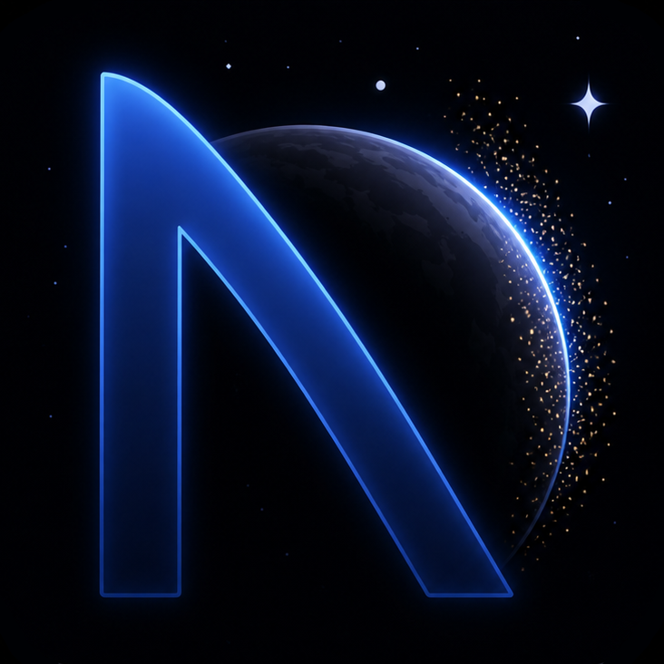
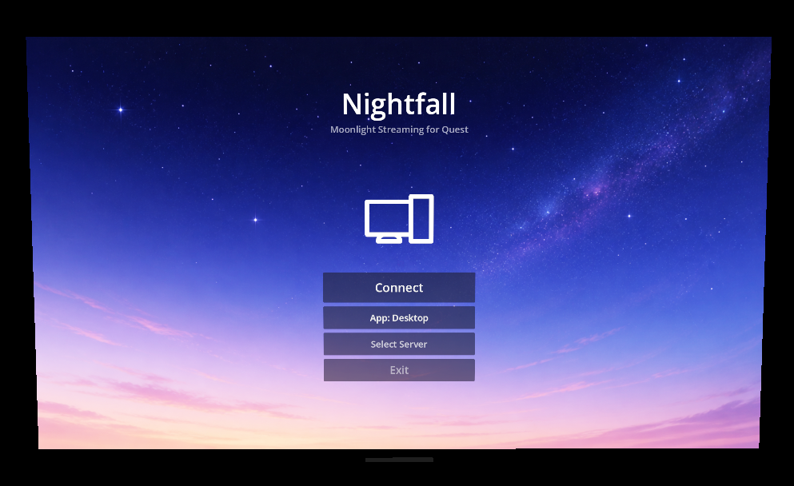

<div align="center">



# Nightfall

**VR-first GameStream client for Meta Quest.**

Stream your PC games into a virtual living room - repositionable screens, stereoscopic 3D,
passthrough, and AI depth estimation, all built native on Godot 4 and OpenXR.

[](https://github.com/tB0nE/nightfall/stargazers)
[](LICENSE)
[](https://github.com/tB0nE/nightfall/releases/latest)

[Features](#features) · [Why Nightfall](#why-nightfall) · [Usage](#usage-and-requirements) · [Building](#building) · [Donate](#donate) · [License](#license)

</div>

---

## Features

- **VR-native streaming** - floating screen in 3D space with grab bars, corner resize, and curvature options
- **HEVC hardware decoding** - NDK MediaCodec pipeline for low-latency H.265 on Quest 3/3S
- **Stereoscopic 3D** - five modes: 2D, SBS Stretch, SBS Crop, AI 3D (MiDaS), and AI 3D v2 (Depth Anything)
- **AI depth estimation** - MiDaS v2 and Depth Anything V2 TFLite models convert any 2D stream into stereoscopic 3D via DIBR
- **Shader smoothing & sharpening** - Gaussian blur (0–50%) plus CAS adaptive sharpening (0–50%) on the stream
- **Touch-style pointer** - laser pointer with trigger-to-click, grip for right-click, thumbstick scroll; circle or arrow cursor
- **Passthrough** - see your real room with the stream floating in front of you
- **Curved screen** - flat, slight curve, or full curve with a single button press
- **Quest Touch Plus models** - real controller models instead of placeholder boxes
- **Starfield environment** - ambient particle starfield for immersion

<div align="center">

</div>

## Why Nightfall

There is no native Moonlight client on the Quest. Existing options like Moonlight Android and Artemis run as flat Android apps - they work inside a 2D window, not in XR/VR space. This means you can't use Quest-native features like stereoscopic SBS rendering, AI-powered 3D depth conversion, or passthrough while streaming. You're staring at a flat panel in a flat app, same as any phone screen.

Nightfall is built from scratch as a native OpenXR application. The stream lives in 3D space - you can grab it, curve it, resize it, and place it wherever you want. AI depth estimation turns any 2D game into stereoscopic 3D in real-time, something flat clients simply cannot do because they don't have per-eye rendering access.

Beyond gaming, a native streaming client on the Quest that works with any server - Windows, Mac, or Linux - becomes a serious desktop streaming tool. Pull up your IDE, terminal, or browser on a massive virtual screen with passthrough so you can still see your desk. The Quest becomes a portable workstation, not just a headset.

## Usage and Requirements

### Host (PC)

Nightfall streams from any GameStream-compatible server on your local network:

- **[Sunshine](https://github.com/LizardByte/Sunshine)** - open source GameStream host (recommended)
- **[Apollo](https://github.com/ClassicOldSong/Apollo)** - Sunshine fork with virtual display and extra features
- **[Polaris](https://github.com/papi-ux/polaris)** - lightweight GameStream server for macOS and Linux

Setup:
1. Install and configure Sunshine on your PC
2. Open the Sunshine web UI at `https://<your-pc-ip>:47990`
3. Create a username and password
4. Add your games/apps to the Sunshine library

### Client (Quest)

1. Sideload Nightfall onto your Quest 3 or 3S (via SideQuest, ADB, or [Obtainium](https://github.com/ImranR98/Obtainium))
2. Launch the app - you'll see the welcome screen
3. Select a server from auto-discovered hosts, or press **Select Server** to enter an IP address manually
4. Press **Connect** to pair and start the stream
5. Enter the displayed PIN in your server's web UI
6. The stream starts automatically

### Controls

| Input | Action |
|---|---|
| **Trigger** | Left-click / interact |
| **Grip** | Right-click |
| **Right thumbstick Y** | Scroll |
| **B button** | Toggle menu |
| **A button** | Toggle keyboard |
| **Grab bars** | Drag to reposition screen/menu |
| **Corner handles** | Resize screen (locked 16:9) |

## Building

See [BUILD.md](BUILD.md) for full build instructions including:

- GDExtension compilation (cmake + ninja, not manual clang++)
- vcpkg dependency setup
- APK export via Godot headless
- Quest deployment via ADB

Quick start:

```bash
# 1. Build the GDExtension
cd addons/nightfall-stream
cmake --preset android
ninja -C build/android

# 2. Export the APK
./build.sh --debug

# 3. Install to Quest
adb install -r Nightfall-Android-arm64-v8a-debug.apk
```

> [!WARNING]
> Always use cmake + ninja to build the GDExtension. Manual clang++ compilation produces `.so` files
> that depend on `libc++_shared.so`, which isn't in the APK and causes `UnsatisfiedLinkError` crashes.

## Donate

Nightfall is a spare-time project built to make VR game streaming feel native
instead of bolted on. If it becomes part of your setup, that alone makes my day.
Donations help keep the coffee flowing and the commits coming.

[](https://www.paypal.com/paypalme/fadecomics)

## License

Nightfall is licensed under the **GNU General Public License v3.0**. See [LICENSE](LICENSE) for the full text.

Special thanks to the [Moonlight-Godot](https://github.com/html5syt/Moonlight-Godot) project, which served as a reference implementation, and to [Janyger](https://github.com/Janyger) for AI 3D contributions to Artemis. Compatible with
[Apollo](https://github.com/ClassicOldSong/Apollo), [Sunshine](https://github.com/LizardByte/Sunshine), and [Polaris](https://github.com/papi-ux/polaris).
